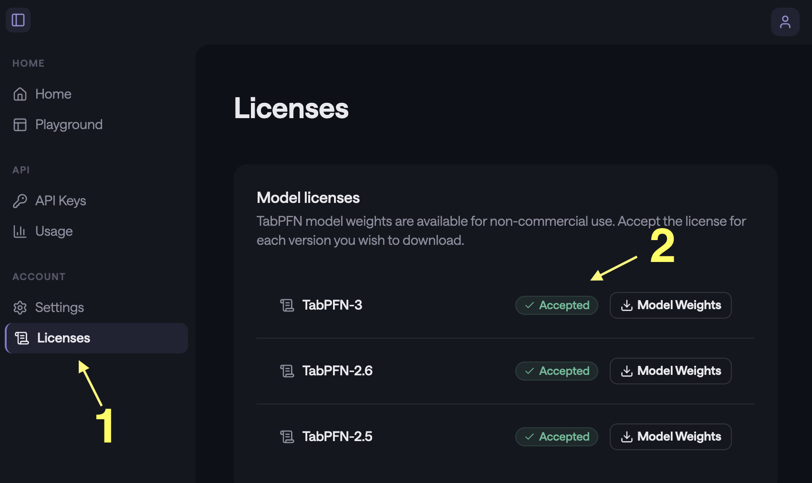

```{r, include = FALSE}
knitr::opts_chunk$set(
  collapse = TRUE,
  comment = "#>",
  fig.path = "man/figures/README-",
  out.width = "100%"
)
```

# tabpfn

<!-- badges: start -->
[](https://CRAN.R-project.org/package=tabpfn)
[](https://github.com/tidymodels/tabpfn/actions/workflows/R-CMD-check.yaml)
[](https://app.codecov.io/gh/tidymodels/tabpfn?branch=main)
<!-- badges: end -->

tabpfn, meaning prior fitted networks for tabular data, is a deep-learning model. See:

- [_Transformers Can Do Bayesian Inference_](https://arxiv.org/abs/2112.10510) (arXiv, 2021)
- [_TabPFN: A Transformer That Solves Small Tabular Classification Problems in a Second_](https://arxiv.org/abs/2207.01848) (arXiv, 2022)
- [_Accurate predictions on small data with a tabular foundation model_](https://scholar.google.com/scholar?hl=en&as_sdt=0%2C7&q=%22Accurate+predictions+on+small+data+with+a+tabular+foundation+model%22) (Nature, 2025)

This R package is a wrapper of the [Python library](https://github.com/PriorLabs/tabpfn) via reticulate. It has an idiomatic R syntax using standard S3 methods. 

## Installation

You can download the package from CRAN via:

```{r}
#| eval: false
install.packages("tabpfn")
```

or you can install the development version of tabpfn like so:

```{r}
#| eval: false
require(pak)
pak(c("tidymodels/tabpfn"), ask = FALSE)
```

You'll need a Python virtual environment to access the underlying library. After installing the R package, tabpfn will install the required Python bits when you first fit a model: 

```
> library(tabpfn)
>
> predictors <- mtcars[, -1]
> outcome <- mtcars[, 1]
>
> # XY interface
> mod <- tab_pfn(predictors, outcome)
Downloading uv...Done!
Downloading cpython-3.12.12 (download) (15.9MiB)
 Downloading cpython-3.12.12 (download)
Downloading setuptools (1.1MiB)
Downloading scikit-learn (8.2MiB)
Downloading numpy (4.9MiB)

<downloading and installing more packages>

 Downloading llvmlite
 Downloading torch
Installed 58 packages in 350ms
> mod
tabpfn Regression Model

Training set
i 32 data points
i 10 predictors
```

## Example


After loading the package: 

```{r}
#| label: tab-start-up
library(tabpfn)
```

we can fit a model via the standard x/y interface. 

```{r}
#| label: mtcars
set.seed(364)
reg_mod <- tab_pfn(mtcars[1:25, -1], mtcars$mpg[1:25])
reg_mod
```

There are also formula and recipes interfaces. 

Prediction follows the usual S3 `predict()` method: 

```{r}
#| label: mtcars-pred
predict(reg_mod, mtcars[26:32, -1])
```

tabpfn follows the tidymodels prediction convention: a data frame is always returned with a standard set of column names. 

For a classification model, the outcome should always be a factor vector. For example, using these data from the modeldata package: 

```{r}
#| label: cls
#| results: none
library(modeldata)
library(ggplot2)

two_cls_train <- parabolic[1:400,  ]
two_cls_val   <- parabolic[401:500,]
grid <- expand.grid(X1 = seq(-5.1, 5.0, length.out = 25), 
                    X2 = seq(-5.5, 4.0, length.out = 25))

set.seed(3824)
cls_mod <- tab_pfn(class ~ ., data = two_cls_train)

grid_pred <- predict(cls_mod, grid)
grid_pred
```

The fit looks fairly good when shown with out-of-sample data: 

```{r}
#| label: boundaries
#| fig.width: 5
#| fig.height: 4
#| fig.align: "center"
#| out.width: 70%

cbind(grid, grid_pred) |>
  ggplot(aes(X1, X2)) +
  geom_point(
    data = two_cls_val,
    aes(col = class, pch = class),
    alpha = 3 / 4,
    cex = 3
  ) +
  geom_contour(
    aes(z = .pred_Class1),
    breaks = 1 / 2,
    col = "black",
    linewidth = 1
  ) +
  coord_equal(ratio = 1)
```

## License

[PriorLabs](https://priorlabs.ai/) created the model. Starting with version 2.5, using TabPFN requires accepting the model license and setting a token. Each model version (v2.5, v2.6, etc.) has its own license that must be accepted individually.

To get access, visit [https://ux.priorlabs.ai](https://ux.priorlabs.ai), go to the **Licenses** tab (1), and accept the license for each model version you intend to use (2). Then set the `TABPFN_TOKEN` environment variable with the token from your account. Users who already have `TABPFN_TOKEN` set can use TabPFN v2 without any additional steps.



Also, the model is most effective when a GPU is available (by an order of magnitude or two). This may seem obvious to anyone already working with deep learning models, but it is a fairly new requirement for those strictly working with traditional tabular data models. 

## Code of Conduct
  
Please note that the tabpfn project is released with a [Contributor Code of Conduct](https://contributor-covenant.org/version/2/1/CODE_OF_CONDUCT.html). By contributing to this project, you agree to abide by its terms.
